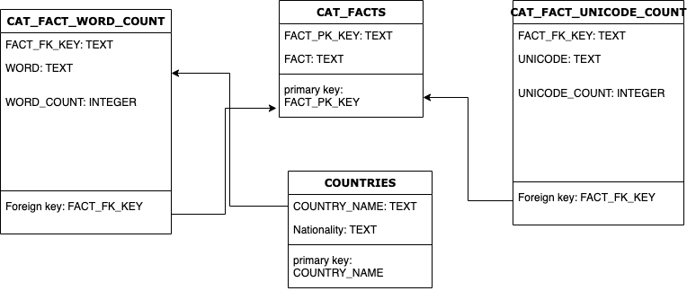
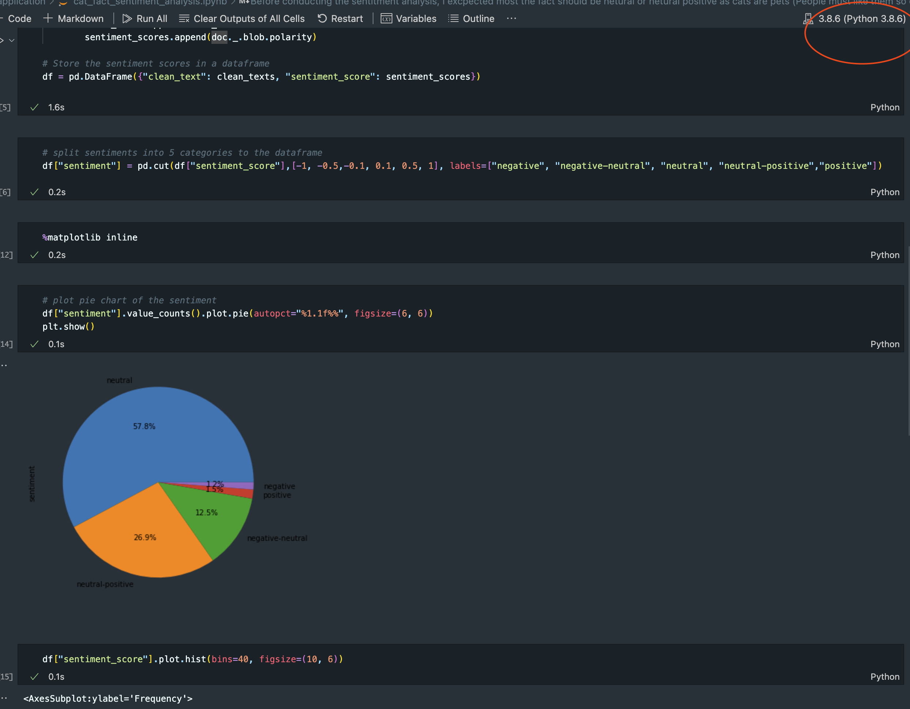

We are expecting your repo with the following:

1. High level summary of the architecture used

2. Package your code, it should be rerunable

3. List any extra objects required to complete the exercise

4. Explain how to schedule this process to run multiple times per day?

5. How would you deploy this project?

**Bonus**: Can you make it to run on a container (Docker)? 

---
## A. Cat Lovers

If you are a cat lover, you would enjoying processing [cat fact](https://catfact.ninja/fact).

For this exercise, build a comprehensive cat fact dataset with an autonomous data load.

We are expeting the following queries and some results:

1. Can you list the number of words only in the dataset?

2. What was the most common unicode character?

3. List the top 20 words based on number of facts?

4. List the most common Geographical country in the dataset?

5. Which fact check you found most interesting?

6. Bonus: Can you make any sentiment analysis from those facts?

---

# Summary of solution:

## Approaches:
The main task is to get comprehensive cat facts from an REST API https://catfact.ninja/fact and generate reporting base on fetched cat facts. 
### Main Task
#### Fetch cat facts from API

I started with getting cat facts by using the [cat fact](https://catfact.ninja/fact) API, it returns a random cat fact each time an API call is made. Without knowing how many cat facts from the API so I started with a huge number API calls (10000 times); I noticed that it taking time to gather for returning all 10000 facts. I decided to make the API call asynchronously, `asyncio` and `aiohttp` are used as they the most command packges for making API requests asynchronously in Python. From there, I also found there is [cat facts](https://catfact.ninja/facts) API end from the same site, which return a set of facts.

In order to save time and resource, I decided to use [cat facts](https://catfact.ninja/facts) instead, but I still decide to use `asyncio` and `aiohttp` in consdieration the whole dataset may scale up in later days. By doing some tests, I set the rate to 10 requests per API call and and wait for 0.1 secs between API calls. All data return succesfully. I also ready the total page dynamically from the response payload in case there are more data is added to the dataset.

#### Store the data and Querying (Reporting)

A sql engine is used for storing all the cat facts data. For the purpose of this practices, not cloud sql engine is used as they all required credential/cost to use the service. Therefore, `sqlite3` is used to store the data. In a production enviroment, a cloud sql engine like `Bigquery`, `SnowFlake` will be a better solutin to store huge amount of data.

- External data: [Country data](https://raw.githubusercontent.com/Dinuks/country-nationality-list/master/countries.csv) is used and loaded to the database at the initial stage

- Tables ERD


- Answering the Reporting question: To answer all the question, generic SQL query will be generated in-flight by using `Jinja2` rendering (eg, most common or least common, top 1 or top 10) so that it can be re-usded in different scenarios.

#### Answers:

1. Can you list the number of words only in the dataset?
	- Total number of words: 1876
2. What was the most common unicode character?	
 	- Most common unicode is ` ` and count is 6550
3. List the top 20 words based on number of facts?
	- Top 20 words and count: [('the', 271), ('cat', 193), ('to', 174), ('a', 171), ('of', 161), ('and', 138), ('cats', 133), ('in', 115), ('is', 106), ('The', 85), ('are', 77), ('their', 72), ('A', 71), ('Cats', 63), ('have', 62), ('as', 56), ('that', 55), ('can', 54), ('it', 41), ('on', 41)]
4. List the most common Geographical country in the dataset?
 	- Most common country is Egypt and count is 11
5. Which fact check you found most interesting?
	- In ancient Egypt, when a family cat died, all family members would shave their eyebrows as a sign of mourning. ( Interesting, what if... only what if  another family cat dies before new eyebrows grows)

6. Bonus: Can you make any sentiment analysis from those facts?
	- [Bonus answer](#bonus)

#### To Run the program
- **virtualenv with pyenv (pyenv need to be installed)** 

	``` 
	 pyenv virtualenv 3.8.6 playground-interview
	 pyenv activate playground-interview 
	 pip3 install -r requirements_main.txt
	 python3 application/main.py
	```
- **Docker(docker need to be installed)** 
	```
	docker build -t playground .
	docker run playground
	```

### Bonus
**The Jupyter Notebook for sentiment analysis**

[sentiment analysis](https://github.com/siwangs/dataengineer-interview-test/blob/main/application/cat_fact_sentiment_analysis.ipynb)
#### Prequisted

Due to size of the dependency packages, I did not put them as part of requirement of the main task. In order to reran the Jupyter notebook. Please run following command:

- **virtualenv with pyenv (pyenv need to be installed)** 
	```
	pip3 install -r requirements_sentiment.txt
	python3 -m spacy download en_core_web_sm
	```
- **Make sure the correct kernal(python version) is selected when try to rerun the cell in the jupyter notebook**




#### Conlusion of the sentiment analysis
Before conducting the sentitment analysis, I excpected most the fact should be netural or netural positive as cats are pets (People must like them so consider take them as pet, except fot the dog person?)

After cleaning the text, above pie chart and histogram confirm my thoughts: most the fact are neutral or netural positive